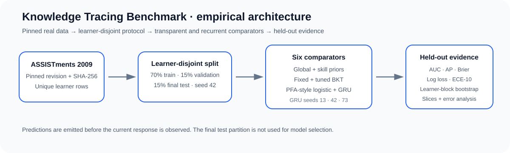
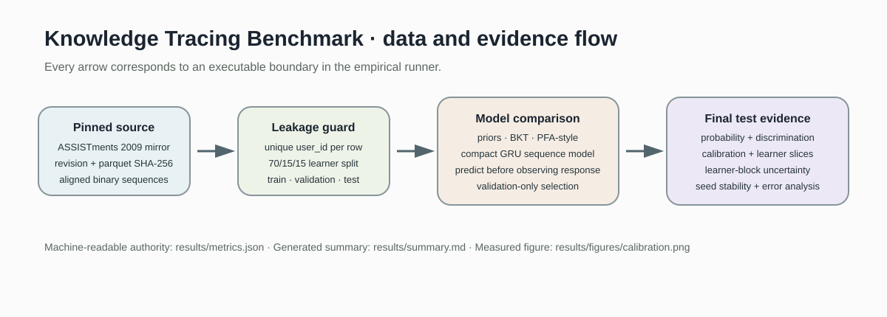
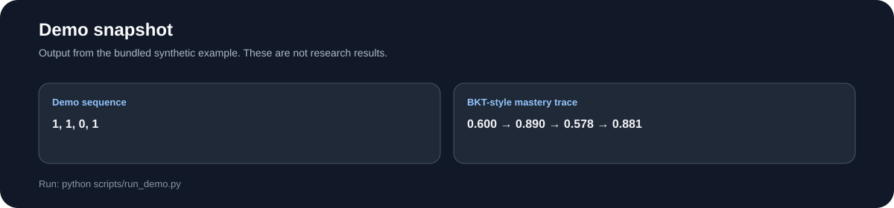
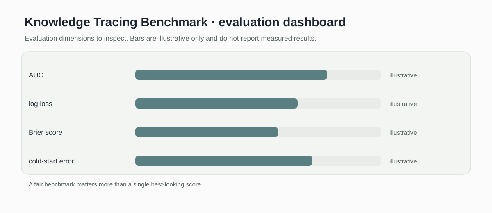

# Knowledge Tracing Benchmark

> Bayesian Knowledge Tracing baseline with a benchmark scaffold for future recurrent and attention-based models.

[](https://github.com/devissaputra/knowledge_tracing_benchmark/actions/workflows/ci.yml)



**Area:** AI in Education (AIEd) · Learner Modeling & Knowledge Tracing    
**Status:** working research prototype  
**Author:** Devis Wawan Saputra

## What this project is for

Knowledge tracing comparisons can be misleading when data splits, cold starts, and calibration are handled differently. This repository provides a transparent Bayesian Knowledge Tracing baseline and a shared evaluation scaffold that future recurrent or attention based implementations can use.

**Who may find it useful:** AIED researchers studying learner knowledge over time and anyone comparing knowledge-tracing models fairly.

## Planned benchmark questions

The current repository implements BKT only. These questions define the comparison the benchmark is intended to support once the additional models and real-data adapters are added.

1. How do BKT, DKT, and attention-based approaches compare under learner-aware splits?
2. How sensitive are results to sequence truncation and cold-start learners?
3. Are gains preserved after calibration and subgroup analysis?

## How it works

The code currently implements Bayesian Knowledge Tracing only. It updates mastery after each binary response using explicit initial mastery, learning, guess, and slip parameters. Recurrent and attention models belong to the planned benchmark, not to the present implementation.



The current data path is response sequence to BKT parameter update to mastery trace. Future model adapters can be evaluated against that same sequence interface once they are actually implemented.



This snapshot shows the bundled synthetic example for Knowledge Tracing Benchmark. It checks the software path; it is not an empirical performance result.

## Methods in the current baseline

- Bayesian Knowledge Tracing
- binary response traces
- explicit BKT parameters
- mastery probability updates
- shared mastery-trace interface

## Data

Toy skill response sequences are included. Real dataset adapters are not bundled; users can connect sources such as ASSISTments or EdNet after obtaining them from the original providers and documenting their license and usage terms.

`data/README.md` documents the sample schema and the conditions that should be recorded before any real dataset is connected. Restricted or identifiable learner data should stay outside the repository.

## Run the demo

```bash
git clone https://github.com/devissaputra/knowledge_tracing_benchmark.git
cd knowledge_tracing_benchmark
python scripts/run_demo.py
python -m unittest discover -s tests -v
```

The demo passes four binary responses through BKT and prints the resulting mastery trajectory. Every probability comes directly from the visible parameter values.

## What to evaluate next

The next build should add one recurrent and one attention based implementation behind the same learner-disjoint evaluation interface. Comparisons should include calibration and cold start behavior, not only predictive ranking.

## Evaluation view



The Knowledge Tracing Benchmark dashboard is an evaluation checklist rather than a result chart. The bars are illustrative only; the labels show the evidence a real study would need to collect.

## Limits and responsible use

BKT makes strong assumptions about skill independence, stationarity, and the meaning of correct responses. The present repository is a baseline and benchmark scaffold, not a completed comparison of BKT, DKT, and attention models. See `docs/ethics_and_risks.md` for the broader risk review.

## Repository map

```text
.
├── .github/workflows/ci.yml
├── assets/
│   ├── architecture.svg
│   ├── data_flow.svg
│   ├── demo_snapshot.svg
│   └── evaluation_dashboard.svg
├── data/
│   ├── README.md
│   └── sample.csv
├── docs/
│   ├── ethics_and_risks.md
│   ├── related_work.md
│   └── research_protocol.md
├── reports/model_card.md
├── scripts/run_demo.py
├── src/knowledge_tracing_benchmark/core.py
├── tests/test_core.py
├── CITATION.cff
├── LICENSE
├── pyproject.toml
└── README.md
```

## Research path

A credible next version would:

1. add a real learner sequence adapter with strict learner level splits
2. implement one recurrent model and one attention baseline
3. compare prediction quality, calibration, compute cost, and cold start behavior

## Related work

`docs/related_work.md` points to open projects that are relevant to this problem area. They are context for comparison and study design; this repository does not present their code as its own.

## Citation and license

`CITATION.cff` contains the software citation. The code and original SVG visuals use the MIT License. Any external dataset keeps its own license and usage conditions.
