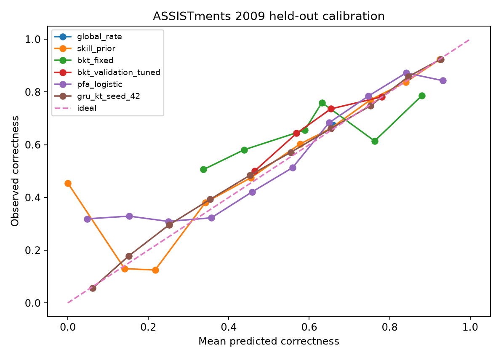

# Knowledge Tracing Benchmark on ASSISTments 2009

[](https://github.com/devissaputra/knowledge_tracing_benchmark/actions/workflows/ci.yml)
[](https://github.com/devissaputra/knowledge_tracing_benchmark/actions/workflows/empirical.yml)

**Research Bundle · AI in Education · learner modeling · empirical knowledge tracing**

A reproducible, learner-disjoint comparison of transparent and recurrent next-response models on real ASSISTments 2009 sequences. The benchmark compares simple priors, fixed and validation-tuned Bayesian Knowledge Tracing, a PFA-style logistic model, and a compact GRU knowledge tracer under one controlled protocol.

This repository is designed to make the evidence chain inspectable: source provenance, leakage safeguards, model-selection boundaries, test metrics, uncertainty, error analysis, ethics, and generated research artifacts are all kept in the repository.


## Research questions

1. Do stateful learner models improve held-out next-response probability quality over global and skill priors?
2. Does validation-tuned BKT improve over a fixed parameterization?
3. Does a PFA-style model using only prior learner-skill successes and failures improve probability quality?
4. Does a compact GRU knowledge tracer add useful sequence information beyond transparent baselines?
5. Do conclusions differ between a learner's first encounter with a skill key and repeated encounters?
6. Are Brier-score differences robust when uncertainty is resampled at the learner level?
7. How stable is the recurrent result across prespecified random seeds?

## Real dataset and provenance

The executable adapter retrieves the public `Atomi/ASSISTments2009` sequence representation pinned to revision:

`c72a664a9693547fb206652ed2ce18e62d320c7d`

The runner records the exact parquet SHA-256, learner count, unique learner count, and interaction count. The mirror is a retrieval representation; the original ASSISTments collection remains the scientific data source. See [DATA.md](DATA.md) and [docs/dataset_card.md](docs/dataset_card.md).

Raw learner data are not committed to the repository.

## Leakage safeguards and split protocol

Before partitioning, the runner requires exactly one serialized row per `user_id`. Duplicate learner rows raise an error.

After that validation:

- 70% of learners are assigned to training;
- 15% to validation;
- 15% to the final test set;
- the split seed is 42;
- no learner crosses partitions;
- every stateful probability is emitted before the response being predicted is observed.

Training learners fit priors, PFA, GRU parameters, and the GRU skill vocabulary. Validation learners are used for BKT parameter selection and GRU early stopping. Final test learners are reserved for evaluation.

## Compared models

1. **Global prior** — training correctness rate.
2. **Skill prior** — training skill rate with global fallback.
3. **Fixed BKT** — explicit fixed Bayesian Knowledge Tracing parameters.
4. **Validation-tuned BKT** — parameters selected from the frozen validation grid.
5. **PFA-style logistic model** — skill identity plus prior learner-skill successes and failures.
6. **Compact GRU knowledge tracer** — recurrent sequence model with documented prior fallback.

The GRU is a compact recurrent benchmark, not a claim of reproducing every canonical Deep Knowledge Tracing implementation. The full empirical run uses seeds **13, 42, and 73** and records both individual runs and repeated-seed summary statistics.

Modern attention-based KT models are discussed in [docs/related_work.md](docs/related_work.md) as extensions; they are not claimed as implemented models.

## Evaluation

The final learner-disjoint test set reports:

- ROC-AUC;
- average precision;
- Brier score;
- log loss;
- ECE-10;
- first-seen skill for learner versus repeated-skill slices;
- learner-block bootstrap Brier differences against the skill-prior baseline;
- repeated-seed GRU stability;
- high-error skill diagnostics with minimum support.

**Terminology:** `first_seen_skill_for_learner` means the first occurrence of the observed skill key in that learner's sequence. It does not mean the skill is globally unseen in training.

The machine-readable source of truth is [results/metrics.json](results/metrics.json). The human-readable table in [results/summary.md](results/summary.md), manuscript results in [paper/results.md](paper/results.md), and measured calibration figure are generated by the same runner.



## Reproduce

For the closest reproduction of the successful empirical GitHub Actions environment:

```bash
python -m venv .venv
source .venv/bin/activate
pip install -r requirements-repro.txt
pip install pytest==9.1.1
PYTHONPATH=src python -m pytest -q
PYTHONPATH=src python src/run_experiment.py
```

For normal development against bounded compatible package versions, use `requirements.txt`.

See [REPRODUCIBILITY.md](REPRODUCIBILITY.md) for the environment boundary and reproducibility notes.

## Research-bundle evidence map

| Evidence | Location |
|---|---|
| Research questions and protocol | [docs/research_protocol.md](docs/research_protocol.md) |
| Dataset provenance and split unit | [DATA.md](DATA.md) |
| Dataset card | [docs/dataset_card.md](docs/dataset_card.md) |
| Model / benchmark card | [reports/model_card.md](reports/model_card.md) |
| Related work and benchmark positioning | [docs/related_work.md](docs/related_work.md) |
| Executable experiment | [src/run_experiment.py](src/run_experiment.py) |
| Core BKT implementation | [src/knowledge_tracing_benchmark/core.py](src/knowledge_tracing_benchmark/core.py) |
| Automated tests | [tests/](tests/) |
| Machine-readable results | [results/metrics.json](results/metrics.json) |
| Generated result summary | [results/summary.md](results/summary.md) |
| Manuscript draft | [paper/paper.md](paper/paper.md) |
| Ethics and non-claims | [ETHICS.md](ETHICS.md) |
| Evidence contract | [RESEARCH_BUNDLE.md](RESEARCH_BUNDLE.md) |

## Interpretation boundary

Knowledge-tracing probabilities are model-dependent predictive summaries. They are not direct measurements of intelligence, motivation, effort, disability, potential, or stable mastery.

Better held-out prediction does not by itself demonstrate better teaching, causal learning improvement, fairness, or suitability for automated educational decisions.

This repository therefore presents a controlled empirical benchmark, not a deployment claim and not a state-of-the-art leaderboard claim.

## Professor review path

For a fast technical review:

**README → DATA → research protocol → experiment runner → tests → generated results → model card → ethics → manuscript**

The central question for review is not whether one model has the highest single score, but whether the comparison is reproducible, leakage-resistant, appropriately scoped, and supported by inspectable evidence.
