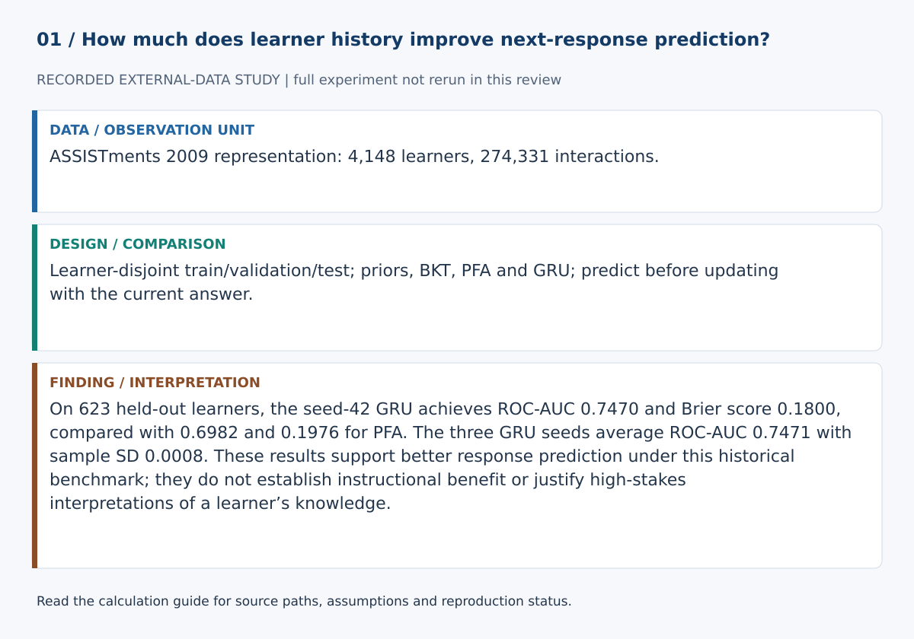
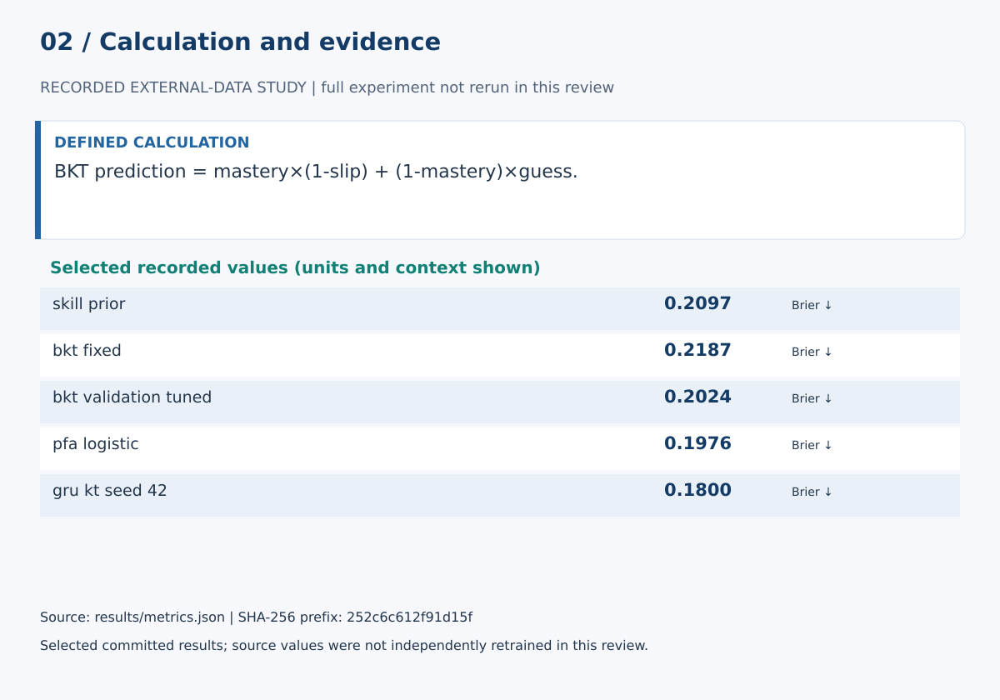

# A Learner-Disjoint Benchmark of Priors, BKT, PFA and Recurrent Knowledge Tracing on ASSISTments 2009

## Abstract

Knowledge-tracing comparisons are easy to overstate when learners cross data partitions or when a neural model is compared only with a weak baseline. This study uses learner-disjoint train, validation and test partitions from ASSISTments 2009 and compares global and skill priors, fixed and validation-tuned Bayesian Knowledge Tracing, a Performance Factors Analysis-style logistic model, and a compact GRU knowledge tracer. Evaluation includes probability quality, discrimination, calibration, first-seen versus repeated-skill slices, learner-block uncertainty, repeated neural seeds, and skill-level error analysis.

## Research questions

1. Do stateful models improve held-out next-response prediction over global and skill priors?
2. Does validation-tuned BKT improve over a fixed BKT parameterization?
3. Does a transparent PFA-style model explain enough history to compete with a recurrent model?
4. Are conclusions stable for first-seen versus repeated skill encounters?
5. How large are learner-block uncertainty intervals around Brier-score differences?
6. How sensitive is the recurrent result to the prespecified GRU seeds?

## Background

Bayesian Knowledge Tracing models a learner's changing latent state for individual knowledge components (Corbett & Anderson, 1995). Performance Factors Analysis provides a transparent logistic alternative based on prior successes and failures (Pavlik, Cen, & Koedinger, 2009). Recurrent neural models later expanded knowledge tracing by learning sequence representations directly from interaction histories (Piech et al., 2015).

This benchmark deliberately keeps classical and recurrent comparators together. That choice follows evidence that conclusions about deep versus classical knowledge-tracing models can depend strongly on dataset characteristics, features, and evaluation design (Gervet et al., 2020). Attention-based models such as SAKT and AKT are important extensions but are outside the current frozen model set (Pandey & Karypis, 2019; Ghosh, Heffernan, & Lan, 2020).

## Data

The scientific source is ASSISTments 2009. The executable pipeline retrieves the public Atomi serialization pinned to revision `c72a664a9693547fb206652ed2ce18e62d320c7d` and records the exact parquet SHA-256. Before splitting, the runner verifies that the serialized learner rows contain unique `user_id` values. See `DATA.md`.

## Design

Learners are shuffled with a fixed seed and assigned 70%/15%/15% to train, validation and test partitions. No learner crosses partitions. Stateful predictions are generated before the current response is observed.

The validation partition is used for BKT parameter selection and GRU early stopping. The final test partition is reserved for evaluation.

## Models

The benchmark includes a global response prior, a training-skill prior, fixed BKT, validation-tuned BKT, PFA-style logistic regression using prior learner-skill successes and failures, and a compact GRU sequence model.

The GRU is evaluated at the prespecified seeds 13, 42, and 73 in the full run. The implementation is a compact recurrent benchmark and is not presented as an exact reproduction of every canonical Deep Knowledge Tracing implementation.

## Evaluation

The final test set reports ROC-AUC, average precision, Brier score, log loss and ECE-10. Metrics are sliced by first-seen and repeated skill encounters. Here, first-seen means the first occurrence of the observed skill key within that learner's sequence, not a skill globally unseen in training.

Brier-score differences are bootstrapped by learner block, skills with sufficiently many test interactions are inspected for high prediction error, and repeated GRU runs are summarized to expose random-seed sensitivity.

## Results

Numerical evidence is generated by `src/run_experiment.py` into `results/metrics.json`, `results/summary.md`, `paper/results.md`, and figures. This methods manuscript intentionally contains no independently hand-entered winner claim.

## Limitations

Skill annotations and response sequences are imperfect proxies for learning. Results are dataset- and protocol-specific; they do not establish teaching effectiveness, causal learning gains, fairness, or suitability for consequential learner decisions. The learner bootstrap is conditional on one prespecified train/validation/test partition and does not test sensitivity to alternative split seeds. Additional datasets, split-sensitivity analysis, and modern attention-based knowledge-tracing models are appropriate extensions before making broader state-of-the-art claims.

## References

Corbett, A. T., & Anderson, J. R. (1995). Knowledge tracing: Modeling the acquisition of procedural knowledge. *User Modeling and User-Adapted Interaction, 4*, 253–278. https://doi.org/10.1007/BF01099821

Feng, M., Heffernan, N. T., & Koedinger, K. R. (2009). Addressing the assessment challenge in an intelligent tutoring system that tutors as it assesses. *User Modeling and User-Adapted Interaction, 19*, 243–266.

Gervet, T., Koedinger, K., Schneider, J., & Mitchell, T. (2020). When is deep learning the best approach to knowledge tracing? *Journal of Educational Data Mining, 12*(3), 31–54. https://doi.org/10.5281/zenodo.4143614

Ghosh, A., Heffernan, N., & Lan, A. S. (2020). Context-Aware Attentive Knowledge Tracing. *Proceedings of the 26th ACM SIGKDD International Conference on Knowledge Discovery & Data Mining*. https://arxiv.org/abs/2007.12324

Pandey, S., & Karypis, G. (2019). A Self-Attentive Model for Knowledge Tracing. *Proceedings of the 12th International Conference on Educational Data Mining*. https://arxiv.org/abs/1907.06837

Pavlik, P. I., Cen, H., & Koedinger, K. R. (2009). Performance Factors Analysis — A New Alternative to Knowledge Tracing. *Proceedings of the 14th International Conference on Artificial Intelligence in Education*, 531–538. https://doi.org/10.3233/978-1-60750-028-5-531

Piech, C., Spencer, J., Huang, J., Ganguli, S., Sahami, M., Guibas, L., & Sohl-Dickstein, J. (2015). Deep Knowledge Tracing. *Advances in Neural Information Processing Systems, 28*. https://arxiv.org/abs/1506.05908

## Calculation definitions and evidence audit

BKT prediction = mastery×(1-slip) + (1-mastery)×guess.

After a response, Bayes updating and the learning transition produce the next mastery state. Brier and log loss assess probabilities; learner-block bootstrap respects within-learner dependence. Model mastery is not directly measured knowledge.

On 623 held-out learners, the seed-42 GRU achieves ROC-AUC 0.7470 and Brier score 0.1800, compared with 0.6982 and 0.1976 for PFA. The three GRU seeds average ROC-AUC 0.7471 with sample SD 0.0008. These results support better response prediction under this historical benchmark; they do not establish instructional benefit or justify high-stakes interpretations of a learner’s knowledge.

The [calculation guide](../CALCULATIONS.md) provides exact evidence paths and a function-level implementation map.

### Selected evidence and interpretation

| Quantity | Value | Unit / meaning | JSON path |
|---|---:|---|---|
| skill_prior | 0.20965724966908303 | Brier ↓ | `test_metrics.skill_prior.all.brier` |
| bkt_fixed | 0.21870446416122305 | Brier ↓ | `test_metrics.bkt_fixed.all.brier` |
| bkt_validation_tuned | 0.20237712440747457 | Brier ↓ | `test_metrics.bkt_validation_tuned.all.brier` |
| pfa_logistic | 0.19760582856803 | Brier ↓ | `test_metrics.pfa_logistic.all.brier` |
| gru_kt_seed_42 | 0.1799516881075459 | Brier ↓ | `test_metrics.gru_kt_seed_42.all.brier` |

These values are read from `results/metrics.json`. They must be interpreted with the split, data status and limitations above. The complete data/model experiment was not rerun in this review. Stored empirical results were inspected, not independently reproduced from raw data.

### Reproduction and claim boundaries

The existing suite requires unavailable dependencies; no full-suite pass is claimed. The figure generator can be checked with `python scripts/build_review_figures.py --check`. This verifies the displayed calculation evidence, not an independent replication of the complete scientific experiment. The manuscript is a working report, not a peer-reviewed publication.
